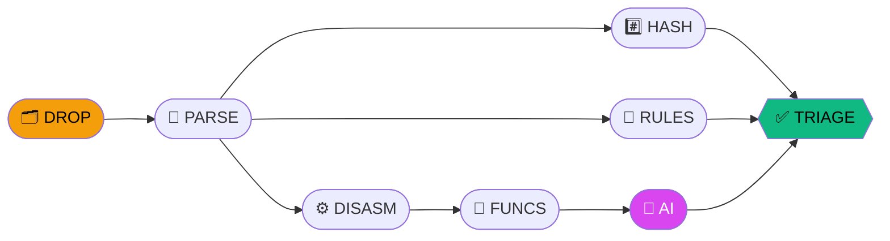
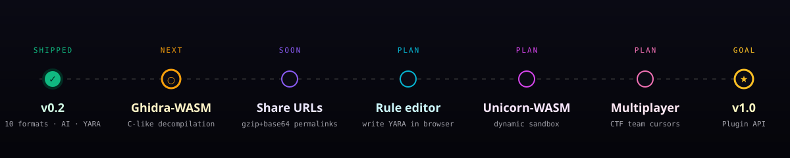

<div align="center">



[](https://cypherdavy.github.io/binscope-/)


</div>

<br/>

<div align="center">



</div>

<br/>

<div align="center">



</div>

<br/>

<div align="center">



</div>

<br/>

<div align="center">



</div>

<br/>

<div align="center">


[](https://github.com/cypherdavy/binscope-)
[](https://github.com/cypherdavy/binscope-/issues)
[](https://github.com/cypherdavy/binscope-/pulls)
[](https://github.com/cypherdavy/binscope-/discussions)

</div>

<br/>

<div align="center">

```bash
git clone https://github.com/cypherdavy/binscope-.git && cd binscope- && npm i && npm run dev
```

</div>

<br/>

<div align="center">

**[@cypherdavy](https://github.com/cypherdavy)** · MIT 

</div>
