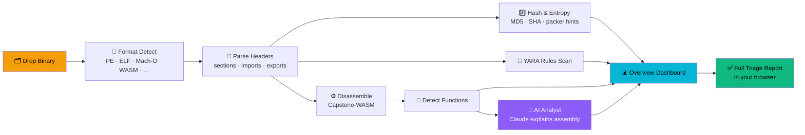

<div align="center">

# ⌬ BinScope

### **Reverse engineering. In your browser. Zero install. Zero uploads.**

Drop in any binary — `.exe`, `.dll`, `.so`, `.dylib`, `.wasm`, `.class`, `.dex`, `.pyc` — and BinScope gives you disassembly, hex, strings, functions, imports, packer detection, entropy analysis, YARA-style rule hits, and an **AI analyst** powered by Claude. All client-side. **Your binary never leaves your tab.**

[**🚀 Try it live →**](https://cypherdavy.github.io/binscope-/)


</div>

---

## 🧠 Why BinScope?

> Ghidra is heavy. IDA is expensive. Online tools upload your sample to a server you don't control.
>
> **BinScope runs entirely in your browser.** No install, no login, no upload. Drop a binary, get instant triage, and ask Claude what the assembly actually does.

Perfect for:
- 🛡️ **Malware triage** — sample never touches a server
- 🚩 **CTF reverse-engineering** — works on Chromebooks, phones, anywhere
- 🎓 **Learning RE** — instant disassembly + AI explanations of every block
- 🔍 **Quick lookups** — "what does this random `.dll` import?"

---

## ✨ Features

| | |
|---|---|
| 🧬 **10+ formats** | PE / PE+ / .NET, ELF, Mach-O (single + FAT/Universal), WASM, Java `.class`, Android DEX, Python `.pyc`, ZIP/JAR/APK, AR, raw |
| 🏗️ **6 architectures** | x86, x86_64, ARM, ARM64, MIPS, RISC-V (via Capstone-WASM) |
| 🔎 **Function detection** | Prologue scanning + call-target inference |
| 📚 **Imports & exports** | PE IAT, ELF `.dynsym`, Mach-O `LC_LOAD_DYLIB`, WASM |
| #️⃣ **Hashes** | MD5, SHA-1, SHA-256 — all computed client-side |
| 📈 **Entropy analysis** | Per-section Shannon entropy chart; auto-flags packed/encrypted regions |
| 📦 **Packer detection** | UPX, VMProtect, Themida, ASPack, PECompact, MPRESS, Enigma, MEW, FSG, PEtite, NSPack, kkrunchy |
| 🎯 **YARA-style rules** | 30+ built-in rules: crypto constants (AES, SHA-256, MD5, CRC32), anti-debug APIs, process injection, malware markers (Mimikatz, Cobalt Strike), compiler fingerprints (Go, Rust, MSVC, MinGW, Nim) |
| 🤖 **AI Analyst** | Select instructions → Claude (Opus 4.7) explains them in plain English |
| 🔤 **Strings · hex · sections** | Virtualized for instant scrolling on huge files |
| 🔒 **Privacy by design** | No backend. No telemetry. Your binary never leaves the browser |

---

## 🖼️ Workflow

<div align="center">



</div>

---

## 🚀 Try it now

> **No install required.** Open the live app and drop any binary onto the page.
>
> ### → [**cypherdavy.github.io/binscope-**](https://cypherdavy.github.io/binscope-/)

For the AI Analyst, paste your [Anthropic API key](https://console.anthropic.com/) into the right-hand panel. It's stored in `localStorage` only — never sent anywhere except Anthropic's API.

---

## 🛠️ Run locally

```bash
git clone https://github.com/cypherdavy/binscope-.git
cd binscope-
npm install
npm run dev
```

Open http://localhost:5173.

---

## 🌐 Deploy your own copy

This repo ships with a GitHub Pages workflow. Fork the repo, then:

1. **Settings → Pages → Source: GitHub Actions**
2. **Settings → Actions → General → Workflow permissions: Read and write**
3. Push to `main` — `.github/workflows/deploy.yml` builds and publishes automatically.
4. If your fork has a different name, update `base` in `vite.config.ts`.

---

## 🗺️ Roadmap

- [ ] **Ghidra decompiler in WASM** — C-like output for any function
- [ ] **Shareable permalinks** — gzip+base64 URLs for small binaries, OPFS for big ones
- [ ] **Custom YARA rule editor** — write & test your own rules in the browser
- [ ] **Dynamic analysis sandbox** — Unicorn-WASM emulator with watchpoints
- [ ] **Multiplayer cursors** — CTF teams reverse together, see each other's selections
- [ ] **Binary diff view** — compare two builds side-by-side
- [ ] **Plugin API** — extend the analyzer in JS

---

## 🤝 Open to collaboration

**BinScope is open source and looking for contributors.** Whether you're a reverse engineer, a frontend dev, an LLM nerd, or just curious — there's room for you.

- 🐛 **Open an [issue](https://github.com/cypherdavy/binscope-/issues)** if something parses wrong, a format is missing, or the UI breaks
- 🔧 **Send a [PR](https://github.com/cypherdavy/binscope-/pulls)** for a new format parser, a YARA rule pack, a UI polish, anything
- 💡 **Got a wild idea?** Start a [discussion](https://github.com/cypherdavy/binscope-/discussions) — roadmap items are open for grabs
- ⭐ **Star the repo** if you want updates — we're moving fast

**Good first issues:** new YARA rules, additional packer signatures, more `Python/pyc` magic numbers, a dark/light theme toggle, format icons.

---

## 🧪 Tech stack

`React 18` · `TypeScript` · `Vite` · `TailwindCSS` · `Capstone-WASM` · `react-window` · `WebCrypto` · `Claude API`

---

## 📜 License

MIT — do whatever you want. Capstone disassembler is BSD-3-Clause.

---

<div align="center">

**Built by [@cypherdavy](https://github.com/cypherdavy) · Powered by Claude.**

If BinScope helped you, [drop a ⭐](https://github.com/cypherdavy/binscope-) — it really does help.

</div>
